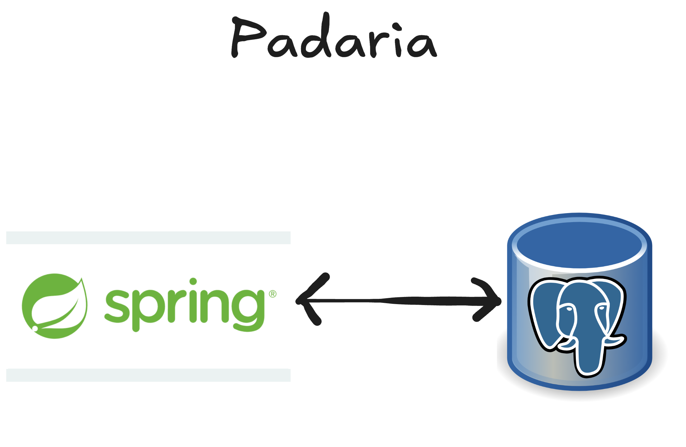
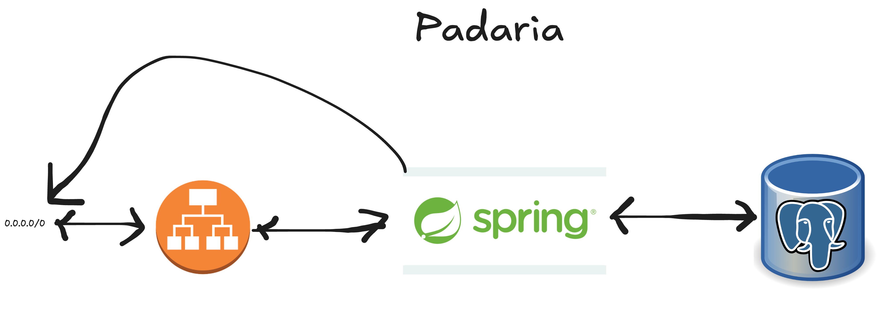
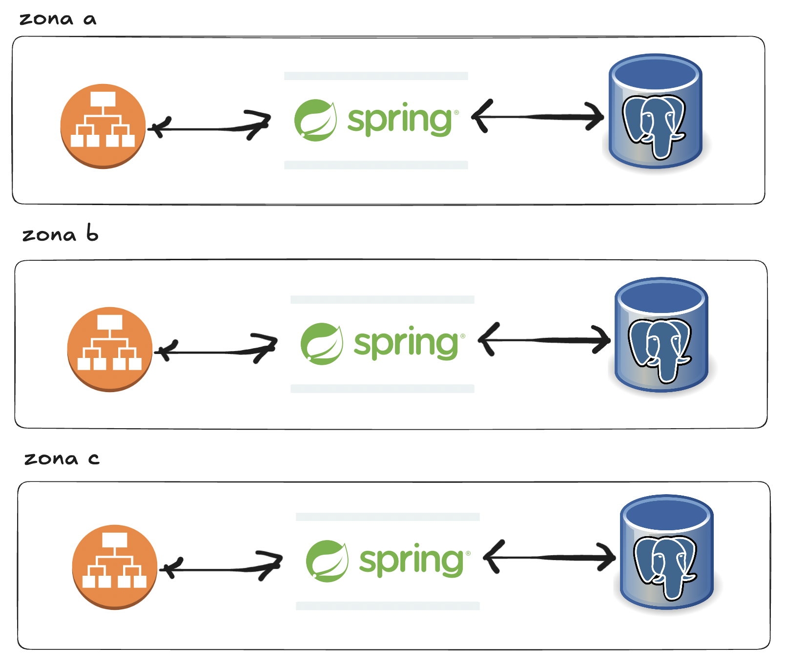
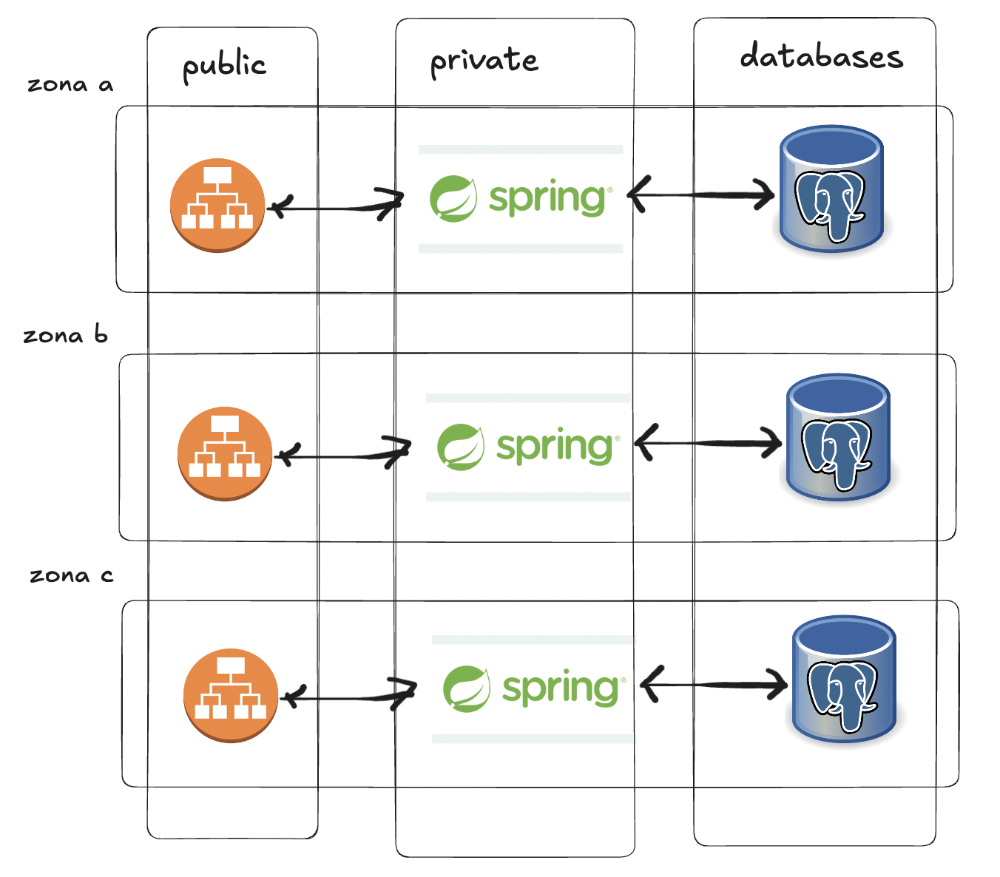
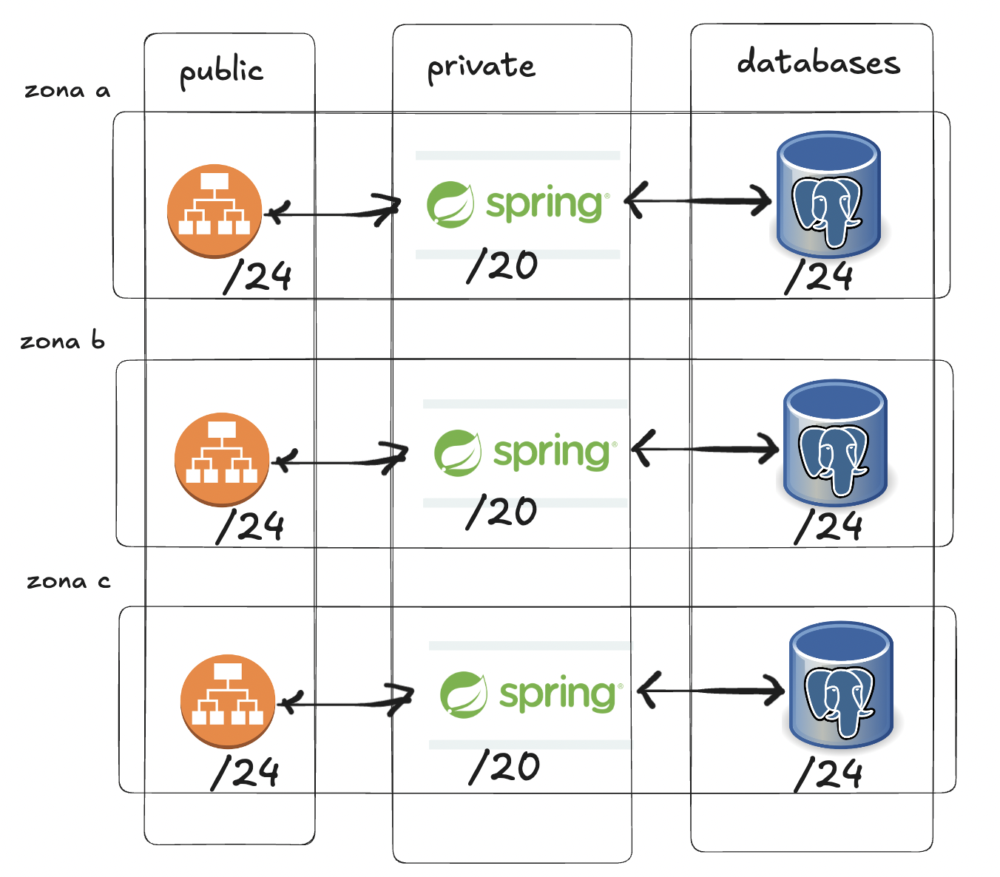
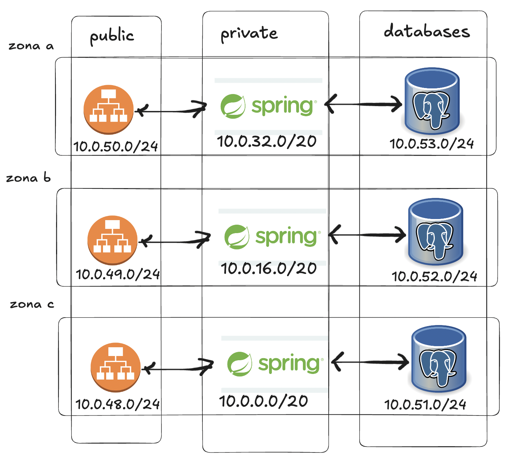

# Arquitetura de containers na AWS: VPCs

Repositório feito a partir da aula do mestre Jedi [Matheus Fidelis](https://github.com/msfidelis) pela Linux Tips (RECOMENDO!).

## Requisitos para executar
- terraform >= v1.9.4;
- aws-cli >= 2.17.2;
- conta na AWS;
- um usuário com permissão de administrador - apenas para facilitar a vida, não faca isso em produção :);
- Access Key ID e Secret Access Key para se autenticar;
- se autentique na sua conta da AWS usando seu Access Key ID e Secret Access Key; 

## Como executar
- Copie o arquivo **environmen/dev/terraform.tfvars.example** e crie um sem o **.example** preenchendo os valores;
- Copie o arquivo **environmen/dev/backend.tfvars.example** e crie um sem o **.example** preenchendo os valores;
- Rode o seguinte commando para subir a infra:

```sh
terraform apply --auto-approve -var-file=environment/dev/terraform.tfvars 
```

- Rode o seguinte commando para destrir a infra:

```sh
terraform destroy --auto-approve -var-file=environment/dev/terraform.tfvars
```

## O racional do projeto: por qual motivo o fizemos assim?

### Como um Dev vai solicitar o ambiente para rodar o projeto dele/dela?

- "Meu amigo DevOps/SRE, vou rodar meu sistema da padaria como um monolitão, onde um sistema Java com spring funciona como API e também serve o frontend dele mesmo. E vou precisar de um Postgres como banco. Se liga nesse diagrama aqui:"



"E outra, precisa estar altamente disponivel, porque nunca sabemos quando o cliente vai querer comprar pão."

### O que a gente entende?

- Que clientes vão precisar acessar o sistema em Java (inbound traffic);
- Que o sistema Java vai precisar chamar algum sistema externo na internet para operações como interagir com um gateway de pagamentos (outbound traffic);
- Que o banco vai ser acessado somente pelo sistema em Java, dentro da rede interna da azure, sem sair para a internet.
- Que precisamos colocar um Load Balancers na frente do sistema, e estes precisam estarem abertos para receber o tráfego vindo da internet;
- Logo, na nossa visão, o sistema fica assim:




- E considerando o requisito de alta disponibilidade, **que é necessário para qualquer sistema de padaria**, decidimos que vamos ter uma "replica" do sistema em mais de uma zona, no nosso caso aqui, em **3 zonas**. Sendo assim, uma visao mais fiel do sistema seria:



- Por essa imagem vemos que temos 3 tipos possveis de redes: (1) publicas (com tráfego de entrada e saída), (2) privadas com tráfego de saída e (3) as redes privadas sem tráfego de entrada e nem de saída, que podemos chamar de **databases**. O que resulta na imagem abaixo:




- Em relação ao tipo 1, conseguimos concluir que não teremos muitas instancias. Logo, é razoável pensar que um bloco /24, contendo 256 IPs é suficiente para essa subnet.
- Em relação ao tipo 2, por ser onde os workloads vão ficar, e considerando que estes escalam bem mais que o Load Balancer, precisamos de uma subnet maior, por isso, /20, dando 4096 IPs, já deve ser suficiente;
- E em relação ao tipo 3, temos o mesmo caso do tipo 1. Logo, /24 é suficiente.
- Sendo assim, a configuração das subnets fica:





- Agora precisamos saber qual o tamanho que a VPC dessa region que vamos deployar o sistema precisa ter. Para isso podemos fazer uma ...**conta de padeiro** :)

```txt
(3 subnets /24 para os Load Balancers) + (3 subnets /20 para os Load Balancers) + (3 subnets /24 para os bancos de dados) = (3 * 256) + (3 * 4096) + (3 * 256) = 13824 IPs.
```

- Se precisamos de 13824 IPs podemos tranquilamente configurar a VPC da region como /16.

- E em termos da distribuição dos IPs em si, podemos comecar pelas redes maiores. Por exemplo, se iniciamos pela **rede privada** da zona a, podemos atribuir a ela a subnet **10.0.0.0/20**. O último IP dessa rede é **10.0.15.255**, logo, a proxima subnet válida para a zona b é **10.0.16.0/20**. Como o último IP desta rede é **10.0.31.255**, a subnet da zona c vai ser **10.0.32.0/20**;

- Como a rede pública e de bancos de dados são similares em termos de tamanho, o raciocínio delas é igual: se a último subnet configurada dentro da VPC foi 10.0.32.0/20 e seu último IP é 10.0.47.255. Logo, a próxima subnet que podemos alocar para a zona a da rede publica vai ser **10.0.48.0/24**.
- Daqui em diante o raciocínio vai ser sempre o mesmo: a próxima subnet inicia onde a ultima termina. Com relação a 10.0.48.0/24, o último IP is 10.0.48.255, logo, a subnet da rede publica da zona b vai ser **10.0.49.0/24**, e  **10.0.50.0/24** para a zona c;
- Para a rede de bancos de dados teremos **10.0.51.0/24** para zona a, **10.0.52.0/24** para zona b e **10.0.53.0/24** para zona c.
- Imagem abaixo mostra isso melhor:




### Controlando o tráfego
- Para a rede publica:
  - Uma vez que esta permite tráfego de **entrada de saída** optamos pelo uso de um **Internet Gateway**
- Para a rede privada:
  - Uma vez que esta permite apenas **saída** podemos seguir com **NAT gateways** associados a um **Elastic IP**.
